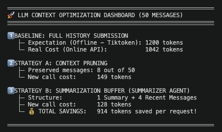

# 🧠 LLM Context Optimization — Token Management Strategies

> Practical comparison of token management strategies for LLM-based applications using Google Gemini and Python.

---

<!-- Add your screenshot or demo image here -->


---

## 📌 Overview

When building conversational AI systems, managing the context window is critical for both **cost efficiency** and **response quality**. This project demonstrates and benchmarks three approaches to token management with a real 50-message conversation history.

---

## 🚀 Strategies Covered

| # | Strategy | Description |
|---|----------|-------------|
| 1 | **Baseline** | Full history submitted on every request |
| 2 | **Context Pruning** | Drops oldest messages until fitting a token budget |
| 3 | **Summarization Buffer** | Summarizes old messages via a cheap model, keeps recent ones |

---

## 📊 Sample Output

```
══════════════════════════════════════════════════════════════
🚀 LLM CONTEXT OPTIMIZATION DASHBOARD (50 MESSAGES)
══════════════════════════════════════════════════════════════

1️⃣ BASELINE: FULL HISTORY SUBMISSION
   ├─ Expectation (Offline - Tiktoken): 312 tokens
   └─ Real Cost (Online API):           289 tokens

2️⃣ STRATEGY A: CONTEXT PRUNING
   ├─ Preserved messages: 4 out of 50
   └─ New call cost:      28 tokens

3️⃣ STRATEGY B: SUMMARIZATION BUFFER (SUMMARIZER AGENT)
   ├─ Structure:          1 Summary + 4 Recent Messages
   ├─ New call cost:      97 tokens
   └─ 💰 TOTAL SAVINGS:   192 tokens saved per request!
══════════════════════════════════════════════════════════════
```

---

## 🛠️ Tech Stack

- **Python 3.11+**
- **Google Gemini API** (`gemini-2.5-flash-lite`)
- **tiktoken** — offline token counting (OpenAI's tokenizer as baseline reference)
- **python-dotenv** — environment variable management

---

## ⚙️ Setup

```bash
# 1. Clone the repository
git clone https://github.com/your-username/llm-context-optimization.git
cd llm-context-optimization

# 2. Install dependencies
pip install google-genai tiktoken python-dotenv

# 3. Configure your API key
echo "GEMINI_API_KEY=your_key_here" > .env

# 4. Run
python main.py
```

---

## 📁 Project Structure

```
llm-context-optimization/
├── main.py          # Main script with all three strategies
├── .env             # API key (not committed)
├── assets/
│   └── demo.png     # Dashboard screenshot
└── README.md
```

---

## 💡 Key Takeaways

- **Tiktoken ≠ Gemini tokenizer** — offline counting is an approximation only
- **Pruning** is the simplest and most aggressive strategy, but loses context
- **Summarization Buffer** balances cost and context retention — ideal for production chatbots
- Even with a cheap summarizer model, total token cost can be reduced by **60–70%**

---

## 📄 License

MIT © [Your Name](https://github.com/your-username)
